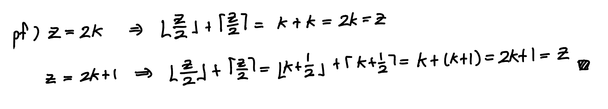
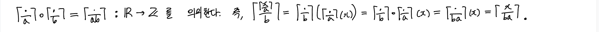
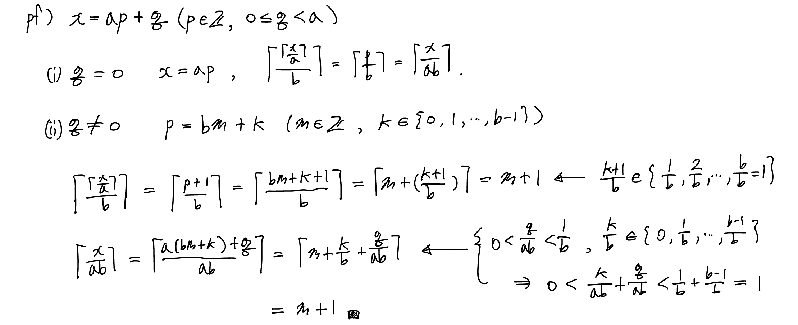
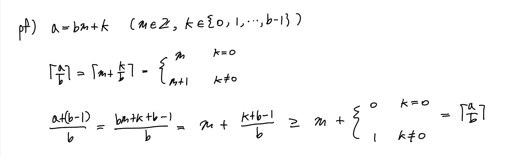
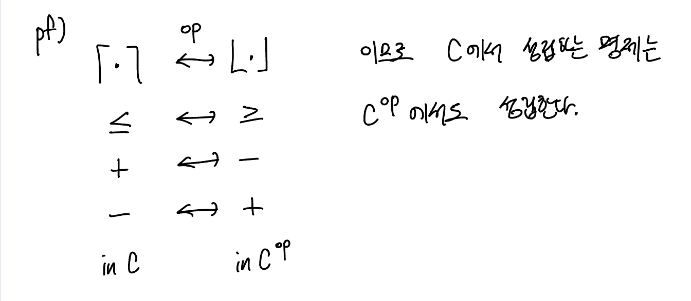
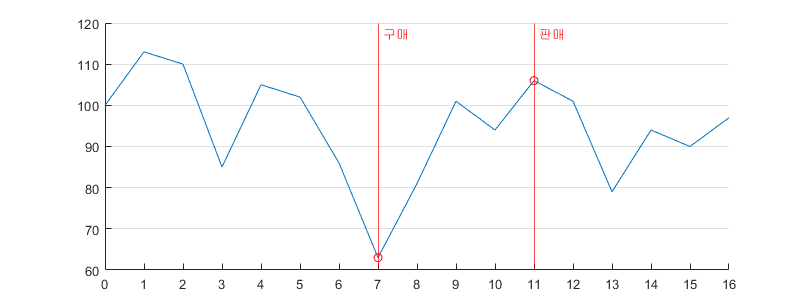
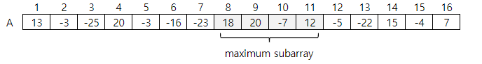

# 1. 알고리즘의 역할
## 1.1 알고리즘
> 알고리즘 : 어떤 값이나 값의 집합을 입력으로 받아 또 다른 값이나 값의 집합을 출력하는 잘 정의된 계산 절차

예) 정렬문제  
Input: n-sequence $\langle a_1,a_2,\dotsc,a_n \rangle$  
Output: a relocation $\langle a'_1,a'_2,\dotsc,a'_n \rangle$ satisfying
$a'_1 \leq a'_2 \leq\dotsc \leq a'_n$

# 2. 시작하기
## 2.1 삽입 정렬
### 정렬문제  
**Input** : n개 원소를 갖는 수열 $\langle a_1,a_2,\dotsc,a_n \rangle$  
**Output** : 재배열 $\langle a'_1,a'_2,\dotsc,a'_n \rangle$ satisfying
$a'_1 \leq a'_2 \leq\dotsc \leq a'_n$


### 의사 코드
```
[INSERTION-SORT(A)]
for j = 2 to A.length
    key = A[j]
    // A[j]를 정렬된 배열 A[1...j-1]에 삽입하여 정렬된 배열 A[1...j]를 만든다.
    i = j-1
    while i > 0 and A[i] > key
        A[i+1] = A[i]
        i = i-1
    A[i+1] = key

루프불변성 : for 루프 안에서 부분배열 A[1...j-1]은 시작할 때마다 원래 A[1...j-1]의 원소들의 정렬된 순서로 구성된다.
```

#### 루프 불변성의 증명
***초기조건*** : j=2일때, A[1]은 한 개의 원소로 구성되므로 정렬되어 있다. 따라서 루프 불변성이 성립한다.
  
***유지조건*** : 정렬된 배열 A[1...j-1]에 A[j]를 삽입할 때, A[j]가 A[j-1], A[j-2], ...의 내림차순대로 크기 비교를 하여 비교값보다 크거나 같으면 삽입하므로 삽입 후의 배열 A[1...j]는 원래 부분배열과 원소가 동일하고 정렬된 순서를 갖는다. 따라서 루프의 다음 반복에서 루프 불변성이 유지된다.
  
***종료조건*** : 마지막으로 루프가 종료되었을 때 어떤 상황이 발생하는지를 조사한다. for루프에서 루프불변성에 의해 j=n+1 이 시작할 때(j=n의 루프가 끝날 때) A[1...n]는 원래 A[1...n]와 원소가 동일하고 정렬된 순서를 갖는다. j=n+1이면 for루프의 반복조건에 성립하지 않으므로 루프를 빠져나간다. 따라서 루프를 빠져나간 후에 전체 배열이 오름차순으로 정렬되었다.

## 2.2 알고리즘의 분석
>알고리즘을 실행하는 데 필요한 자원을 예측한다.

#### *어떠한 모델에서 분석할 것인가?*  
여기서는 단일 프로세서, 랜덤 접근 기계(RAM) 모델에서 컴퓨터 프로그램으로 구현된다고 가정하자. RAM 모델은 차례대로 하나씩 명령어를 수행한다. 명령어들은 산술연산, 제어연산, 데이터이동연산 등을 포함하고 상수 시간이 걸린다. 데이터형은 정수와 부동소수가 있다. 각 데이터의 각 워드 크기에 제한이 있다.  
>입력 크기가 n일 때,&ensp; $2^{bits-1}\leq n\leq 2^{bits}$  
>$log_2(n)\leq bits\leq log_2(n) + 1$  
>$\exists c\geq 1\quad s.t\qquad bits=c\cdot log_2(n)$

이므로 정수는 $c\cdot log_2(n)$ 비트로 표현된다고 가정한다. c를 상수로 고정하여 워드 크기가 임의로 커지지 않게 한다. 워드 하나에 아주 큰 데이터를 저장하면 상수 시간에 이를 처리할 수 없다.

#### *명령어의 고려*
$x^y$를 계산하는 데 많은 명령어 계산이 필요하지만 어떠한 제약이 있다면 상수 시간으로 연산할 수 있다. 왼쪽 쉬프트 연산 $n\ll k$은 $n\times 2^k$ 와 동일하다.

#### *입력크기의 정의*
주어진 문제마다 정의한다. 대부분은 입력 항목의 개수로 정한다.

#### *수행시간의 정의*
기본 연산 개수 또는 실행된 단계의 횟수를 말한다. 기계의 종류에 독립적으로 분석할 수 있도록 가능한 실행 단계의 개념으로 정의하는 것이 편리하다.
>예를 들어, $i$행을 실행하는 데 $c_i$ 시간이 걸린다고 하자.
>```
>[INSERTION-SORT(A)]
>1   for j = 2 to A.length
>2       key = A[j]
>3       // A[j]를 정렬된 배열 A[1...j-1]에 삽입하여 정렬된 배열 A[1...j]를 만든다.
>4       i = j-1
>5       while i > 0 and A[i] > key
>6           A[i+1] = A[i]
>7           i = i-1
>8       A[i+1] = key
>```
>##### 수행 시간
>$T(n)=c_1n+c_2(n-1)+c_4(n-1)+c_5\displaystyle\sum_{j=2}^{n}{t_j}$
>$+c_6\displaystyle\sum_{j=2}^{n}{(t_j-1)}+c_7\displaystyle\sum_{j=2}^{n}{(t_j-1)}+c_8(n-1)$  
>$t_j$: 5행의 while문이 반복되는 횟수  
>##### 최선의 경우
>$t_j=1,$  
>$T(n)=c_1n+c_2(n-1)+c_4(n-1)+c_5(n-1)+c_8(n-1)$  
>$\qquad= an + b$  
>##### 최악의 경우
>$t_j=j,$  
>$T(n)=c_1n+c_2(n-1)+c_4(n-1)+c_5\displaystyle\sum_{j=2}^{n}{j}$
>$+c_6\displaystyle\sum_{j=2}^{n}{(j-1)}+c_7\displaystyle\sum_{j=2}^{n}{(j-1)}+c_8(n-1)$  
>$\qquad= an^2 + bn + c$  
>##### 평균적인 경우
>$t_j=\frac{j}{2},$  
>$T(n)=c_1n+c_2(n-1)+c_4(n-1)+c_5\displaystyle\sum_{j=2}^{n}{\frac{j}{2}}$
>$+c_6\displaystyle\sum_{j=2}^{n}{(\frac{j}{2}-1)}+c_7\displaystyle\sum_{j=2}^{n}{(\frac{j}{2}-1)}+c_8(n-1)$  
>$\qquad= an^2 + bn + c$

#### 최악의 경우와 평균적인 경우의 분석
1. 최악의 경우의 수행시간은 모든 입력의 수행시간에 대한 상한이다.
2. 어떤 알고리즘은 최악의 경우가 상당히 빈번히 발생할 수 있다.
3. 평균적인 경우가 최악의 경우만큼의 성능일 때가 있다. 삽입정렬에서 최악,평균 수행시간이 모두 n에 관한 이차식이다.
4. 어떤 경우는 평균 수행시간이 중요하다. 확률적 분석 기법을 통해서 평균적인 수행시간을 구한다.

#### 증가 차수
구체적으로 명령문의 비용 $c_i$로 표현되는 계수 $a,b,c$를 구할 수 있겠지만, $an^2+bn+c$로 표현되는 것으로 충분하다. 나아가 최고차항인 $an^2$만 고려하고 계수를 무시하여 $\Theta(n^2)$ 로 나타낸다. 수행시간이 입력크기에 무관한 상수 시간이라면 $\Theta(1)$로 나타낸다.

## 2.3 알고리즘의 설계
삽입 정렬은 점진적인 방법이다. 분할정복으로 알려진 다른 방법도 있다.
### 2.3.1 분할정복 접근법
**분할** : 동일한 부분 문제들로 분할한다.  
**정복** : 부분 문제를 재귀적으로 푼다. 문제 크기가 작아지면 직접적인 방법으로 푼다.  
**결합** : 부분 문제의 해를 결합하여 원래 문제의 해를 구한다.  
>예를 들어, 병합정렬  
>**분할** : $A_{given}[1\dotso n] \rightarrow^{div} A_{left}[1\dotso \lfloor\frac{n}{2}\rfloor], A_{right}[\lfloor\frac{n}{2}\rfloor+1\dotso n]$  
>**정복** : 병합 정렬을 이용해 두 부분 배열을 재귀적으로 정렬한다.  
>**결합** : 정렬된 두 개의 부분 배열을 병합해 정렬된 배열 하나로 만든다.
>
>
>#### 의사코드
>```
>// 정렬된 A[p...q]와 A[q+1...r]을 병합한다.
>[MERGE(A,p,q,r)]
>    n1 = q-p+1
>    n2 = r-q
>
>    // 경계값 ub(upper bound)을 포함한 배열 L[1...n1+1]과 R[1...n2+1]을 생성한다.
>    for i=1 to n1
>        L[i] = A[p+i-1]
>    for j=1 to n2
>        R[j] = A[q+j]
>    L[n1+1] = R[n2+1] = ub
>
>    // 배열 L과 R을 정렬된 순서로 병합하여 정렬된 배열 A를 만든다.
>    i = j = 1
>    for k=p to r
>        if L[i] <= R[j]
>            A[k] = L[i]
>            i = i+1
>        else
>            A[k] = R[j]
>            j = j+1
>
>[MERGE-SORT(A,p,r)]
>    if p < r
>        q = [(p+r)/2]  // 올림 or 내림
>        MERGE-SORT(A,p,q)
>        MERGE-SORT(A,q+1,r)
>        MERGE(A,p,q,r)
>
>경계값 : 배열이 모두 비었는지를 조사하지않기 위함. 내림차순 정렬의 경우는 least bound이고
>        오름차순 정렬의 경우는 upper bound이다.
>```

### 2.3.2 분할정복 알고리즘의 분석
주어진 문제를 원래 문제의 $1/b$인 $a$개의 부분 문제로 분할된다고 가정한다.
문제를 분할하는 데 $D(n)$ 시간이 걸리고 부분 문제들의 해를 결합하는 데 $C(n)$ 시간이 걸린다고 하자.

$$
T(n) =
    \begin{cases}
        \Theta(1),           & \quad n \leq c\\
        aT(n/b)+D(n)+C(n),   & \quad n > c
    \end{cases}
$$

위의 점화식을 풀면 주어진 문제의 수행시간을 계산할 수 있다.
>병합정렬에서는
>
>$$
>T(n) =
>    \begin{cases}
>        \Theta(1),           & \quad n = 1\\
>        2T(n/2)+\Theta(n),   & \quad n > 1
>    \end{cases}
>$$
>
>이므로 $T(n) = \Theta(nlg\\:n)$이다.  
>따라서 병합정렬 $\Theta(nlg\\:n)$ 이 삽입정렬 $\Theta(n^2)$ 보다 성능이 좋다.

# 3. 함수의 증가
알고리즘의 **점근적(asymptotic)** 효율성에 관해서 충분히 큰 입력크기에 대해 수행시간 증가의 차수만을 중요하게 취급한다.
## 3.1 점근적 표기
### $\Theta$-표기

$$
\Theta(g(n))= \\{
  f(n): \exists c_1,c_2,n_0 >0 \quad s.t \quad \forall n\geq n_0, 0 \leq c_1g(n) \leq f(n) \leq c_2g(n)
\\}
$$

$g(n)$을 $f(n)$의 **점근적으로 엄밀한 한계**라고 한다.  
$f(n) \in \Theta(g(n))$은 $f(n) = \Theta(g(n))$ 으로 표현한다.

<br>

### $O$-표기

$$
O(g(n))= \\{
  f(n): \exists c_2,n_0 >0 \quad s.t \quad \forall n\geq n_0, 0 \leq f(n) \leq c_2g(n)
\\}
$$

**점근적 상한**을 의미한다.  
$\Theta(g(n)) \subseteq O(g(n))$이 성립한다.

<br>

### $\Omega$-표기

$$
O(g(n))= \\{
  f(n): \exists c_1,n_0 >0 \quad s.t \quad \forall n\geq n_0, 0 \leq c_1g(n) \leq f(n)
\\}
$$

**점근적 하한**을 의미한다.  

<br>

### $o$-표기

$$
\begin{aligned}
  o(g(n))&= \\{
    f(n): \exists n_0 >0 \quad s.t \quad \forall n\geq n_0,\forall c_2 > 0, 0 \leq f(n) < c_2g(n)
  \\} \\
  &= \\{ f(n): \lim\limits_{n \to \infty}{ \frac{f(n)}{g(n)} }=0 \\}
\end{aligned}
$$

**점근적으로 여유있는 상한**을 의미한다. 

<br>

### $\omega$-표기

$$
\begin{aligned}
  \omega(g(n))&= \\{
    f(n): \exists n_0 >0 \quad s.t \quad \forall n\geq n_0,\forall c_1 > 0, 0 \leq c_1g(n) < f(n)
  \\} \\
  &= \\{ f(n): \lim\limits_{n \to \infty}{ \frac{f(n)}{g(n)} }= \infty \\}
\end{aligned}
$$

**점근적으로 여유있는 하한**을 의미한다. 

<br>

### 방정식과 부등식에서의 점근적 표기
* $2n^2+3n+1=2n^2+\Theta(n)$은 익명함수 $f(n) \in \Theta(n)$에 대해  $2n^2+3n+1=2n^2+f(n)$를 나타낸다고 해석한다.  
* $2n^2+\Theta(n)=\Theta(n^2)$은 익명함수 $f(n) \in \Theta(n)$에 대해 모든 $n$에 대해서 $2n^2+f(n)=g(n)$인 익명함수 $g(n) \in \Theta(n^2)$가 있음을 나타낸다고 해석한다.
* $\sum\limits_{i=1}^{n}{O(i)} = f(n), f(n) \in O(n^2)$으로 익명 함수 하나가 나타난 것으로 간주한다.
### 정리
1. $\forall f(n),g(n),$ $\quad f(n)=\Theta(g(n)) \iff f(n) = O(g(n)), f(n) = \Omega(g(n))$  
2. $f(n) = \omega(g(n)) \iff g(n) = o(f(n))$  
    $f(n) = \Omega(g(n)) \iff g(n) = O(f(n))$
3. $A(A(f(n))) = A(f(n)) \quad where \quad A \in \\{ O,o,\Omega,\omega,\Theta \\}$
4. $f(n)=A(f(n)) \quad where \quad A \in \\{ O,\Omega,\Theta \\}$

## 3.2 표준 표기법과 흔히 사용되는 함수
### 내림과 올림
* $\forall x \in \mathbb{R},\quad x-1 < \lfloor x \rfloor \leq x \leq \lceil x \rceil < x+1$  

* $\forall z \in \mathbb{Z},\quad \lfloor\frac{z}{2}\rfloor + \lceil\frac{z}{2}\rceil = z$
> 

* $\forall x \in \mathbb{R}_{\geq 0}, \forall a,b \in \mathbb{N}$에 대해 다음이 성립한다.
  + $\Big\lceil \frac{\lceil {x/a} \rceil}{b}\Big\rceil = \Big\lceil \frac{x}{ab}\Big\rceil$  
  
    >
    >
  + $\Big\lceil\frac{a}{b}\Big\rceil \leq \frac{a+(b-1)}{b}$  
  
    >
  + $\Big\lfloor \frac{\lceil {x/a} \rfloor}{b}\Big\rfloor = \Big\lfloor \frac{x}{ab}\Big\rfloor$  
  
  + $\Big\lfloor\frac{a}{b}\Big\rfloor \geq \frac{a-(b-1)}{b}$  
  
    >

### 모듈로 연산
$\forall a \in \mathbb{Z}, \forall n \in \mathbb{N}\qquad a\mod n = a - n\lfloor a/n \rfloor$  

### Stirling 근사
$n!=\sqrt{2\pi n}\big(n/e\big)^n\big(1+\Theta(1/n)\big)$  
$n!=o(n^n)$  
$n!=\omega(2^n)$  
$lg(n!)=\Theta(nlg(n))$  

### 반복 로그
$lg^*n = min \\{ i \geq 0:lg^{(i)}n \leq 1 \\}$  
$lg^*2 = 1$  
$lg^*4 = 2$  
$lg^*2^4 = 3$  
$lg^*2^{16} = 4$  
$lg^*2^{65536} = 5$  
매우 느리게 증가하는 함수이다.

# 4. 분할정복
**분할** : 현재의 문제와 동일하되 입력의 크기가 더 작은 다수의 부분 문제로 분할한다.  
**정복** : 부분 문제를 재귀적으로 풀어서 정복한다. 부분 문제의 크기가 충분히 작으면 직접적인 방법으로 푼다.  
**결합** : 부분 문제의 해를 결합해 원래 문제의 해가 되도록 만든다.  

* 부분 문제가 재귀적으로 풀 수 있을 만큼 충분히 클 때 **재귀 대상**이라 한다.
* 부분 문제가 충분히 작아져서 더 이상 재귀 호출을 할 수 없을 때 **베이스 케이스**까지 내려왔다고 한다.

## 4.1 최대 부분 배열 문제
### 문제
주어진 가격 변동표에 대한 최대 이익을 내는 거래일자(구매일,판매일)를 구하라.

날짜|0|1|2|3|4|5|6|7|8|9|10|11|12|13|14|15|16
---|:-:|:-:|:-:|:-:|:-:|:-:|:-:|:-:|:-:|:-:|:-:|:-:|:-:|:-:|:-:|:-:|:-:
가격|100|113|110|85|105|102|86|63|81|101|94|106|101|79|94|90|97
변동|A|13|-3|-25|20|-3|-16|-23|18|20|-7|12|-5|-22|15|-4|7



<br><br><br>

### 모든 경우를 계산하는 풀이
모든 (구매일,판매일) 쌍 $\binom{n}{2}$개에 대해서
값을 평가하는데 최소한 상수시간이 걸리므로 $\Omega(n^2)$이다.
<br><br>

### 분할정복 풀이
#### 최대부분배열
>가장 큰 합을 갖는 연속 부분 배열  

주어진 문제에 대한 해답은 변동에 대한 최대부분배열이다.  


#### 최대부분배열 구하기
* $A[low..high]$의 최대부분배열 $A[i..j]$은 다음 중 하나만 성립한다.
  + $A[i..j] \subseteq A[low..mid]$
  + $A[i..j] \subseteq A[mid+1..high]$
  + $i \leq mid < j$

<br>

* $i \leq mid < j$ 의 경우
```
[FIND-MAX-CROSSING-SUBARRAY(A;low,mid,high)]
// find maximum of left_sum
left_sum = -lower_bound
sum = 0
for i = mid downto low
    sum = sum + A[i]
    if sum > left_sum
        left_sum = sum
        find_i = i
end
// find maximum of right_sum
right_sum = -lower_bound
sum = 0
for j = mid downto high
    sum = sum + A[i]
    if sum > right_sum
        right_sum = sum
        find_j = j
end
return (find_i,find_j,left_sum+right_sum)

참고 : 실제 코드에서는 입력값의 범위에 대해 오버플로우가 발생하는 경우를 생각해야한다.
```  
> 수행시간 : $\Theta(n)$

<br>

* **분할정복 알고리즘**
```
[FIND-MAXIMUM-SUBARRAY(A;low,high)]
if high == low
    return (low,high,A[low])  // 베이스 케이스
else
    mid = [(low+high)/2]      // 올림 or 내림
    // 최대부분배열은 다음 3가지 중 하나이다.
    (left_low,  left_high,  left_sum)   = FIND-MAXIMUM-SUBARRAY(A,low,mid)
    (right_low, right_high, right_sum)  = FIND-MAXIMUM-SUBARRAY(A,mid+1,high)
    (cross_low, cross_high, cross_sum)  = FIND-MAX-CROSSING-SUBARRAY(A,low,mid,high)

    // 최대부분배열 찾기.
    if      left_sum  >= right_sum  &&  left_sum  >= cross_sum
        return (left_low,  left_high,  left_sum)
    elseif  right_sum >= left_sum   &&  right_sum >= cross_sum
        return (right_low, right_high, right_sum)
    else
        return (cross_low, cross_high, cross_sum)
```  
> 수행시간 : $\Theta(nlg(n))$  

<br>

* **수행시간 계산**  
마스터 방법을 사용하면 점화식의 해가 다음과 같다.  

$$
\begin{aligned}
  T(n) & =
    \begin{cases}
      \Theta(1), & \quad n \leq c \\
      2T(n/2)+\Theta(n)+\Theta(1),   & \quad n > c
    \end{cases}
    \\
    \\
  & =
    \begin{cases}
      \Theta(1), & \quad n \leq c \\
      2T(n/2)+\Theta(n),   & \quad n > c
    \end{cases}
    \\
    \\
  & = \Theta(nlg\\:n)
\end{aligned}
$$

<br><br>

## 4.2 행렬 곱셈을 위한 스트라센 알고리즘
